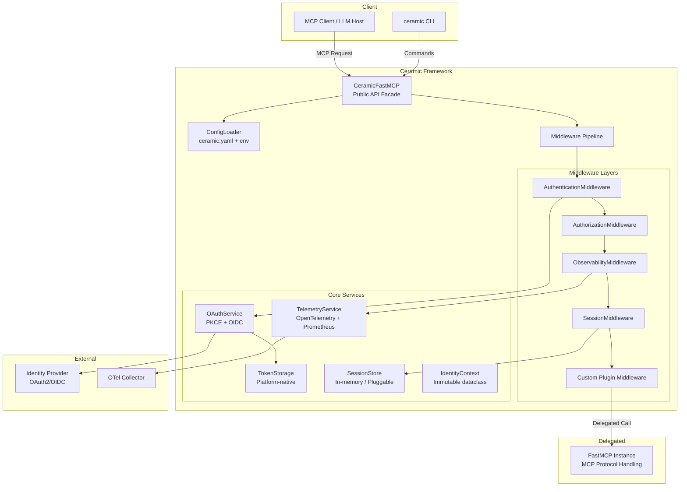
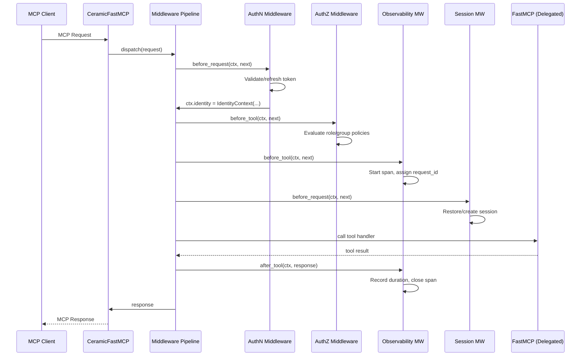

# Design Document: Ceramic Framework

## Overview

Ceramic is a Python framework that wraps FastMCP via internal composition (delegation) to provide enterprise capabilities—authentication, authorization, observability, session management—while preserving 100% API compatibility with FastMCP's public surface. The core architectural principle is that Ceramic never inherits from or reimplements FastMCP; it instantiates a FastMCP instance internally and delegates all MCP protocol handling to it, intercepting the request lifecycle through a middleware pipeline.

The framework is configured declaratively via `ceramic.yaml`, activated by a single import change (`from ceramic import FastMCP`), and operated through a dedicated CLI (`ceramic run/login/logout/whoami/doctor/config validate`). A plugin system allows third-party extensions at well-defined hook points.

### Key Design Decisions

1. **Composition over Inheritance**: Ceramic holds a `FastMCP` instance as a private attribute, forwarding all public API calls. This decouples Ceramic's lifecycle from FastMCP's internal implementation.
2. **Middleware Pipeline**: All enterprise features are implemented as middleware layers that execute before/after the delegated FastMCP handler. This keeps features composable and independently testable.
3. **Configuration-Driven Activation**: Features are opt-in via `ceramic.yaml`. When no config is present, Ceramic behaves identically to vanilla FastMCP.
4. **Context Propagation via contextvars**: Request-scoped state (identity, session, trace) is propagated using Python's `contextvars` module, making it accessible anywhere in the call stack without explicit parameter passing.

## Architecture

### High-Level Component Diagram



### Request Flow



### Middleware Execution Order

The pipeline executes middleware in registration order. Built-in middleware is registered in this fixed order:

1. **ObservabilityMiddleware** (outermost) — starts span, assigns request ID
2. **SessionMiddleware** — restores session or marks as new
3. **AuthenticationMiddleware** — validates/refreshes token, populates identity
4. **AuthorizationMiddleware** — evaluates policies
5. **Custom Plugins** (in registration order)
6. **Delegation to FastMCP** (innermost)

The `after_*` hooks execute in reverse order (inside-out).

## Components and Interfaces

### 1. CeramicFastMCP (Public Facade)

The drop-in replacement class that mirrors FastMCP's public API.

```python
class CeramicFastMCP:
    """Drop-in replacement for fastmcp.FastMCP with enterprise features."""
    
    def __init__(self, name: str = "ceramic", config: str | Path | None = None, **kwargs):
        """
        Args:
            name: Server name (passed to FastMCP).
            config: Path to ceramic.yaml. If None, uses CERAMIC_CONFIG env var
                    or ./ceramic.yaml. If no config found, runs in passthrough mode.
            **kwargs: All additional kwargs forwarded to FastMCP.__init__.
        """
        ...
    
    # Delegated decorators (signature-compatible with FastMCP)
    def tool(self, *args, **kwargs): ...
    def prompt(self, *args, **kwargs): ...
    def resource(self, *args, **kwargs): ...
    
    # Transport methods (delegated)
    def run(self, transport: str = "stdio", **kwargs): ...
    
    # Ceramic-specific API
    def use(self, plugin: "MiddlewarePlugin") -> None: ...
    
    # Migration helper for existing FastMCP instances
    @staticmethod
    def enable_ceramic(app: "fastmcp.FastMCP", config: str | Path | None = None) -> "CeramicFastMCP": ...
```

### 2. ConfigLoader

Handles YAML parsing, environment variable overrides, and validation.

```python
class CeramicConfig(BaseModel):
    """Pydantic model for ceramic.yaml validation."""
    auth: AuthConfig | None = None
    authorization: AuthorizationConfig | None = None
    observability: ObservabilityConfig | None = None
    sessions: SessionsConfig | None = None
    plugins: list[PluginRef] | None = None
    hot_reload: HotReloadConfig | None = None

class ConfigLoader:
    def load(self, path: Path | None = None) -> CeramicConfig: ...
    def apply_env_overrides(self, config: CeramicConfig) -> CeramicConfig: ...
    def watch(self, callback: Callable[[CeramicConfig], None]) -> None: ...
```

### 3. Middleware Protocol

```python
from typing import Protocol, Callable, Awaitable

class RequestContext:
    """Mutable request-scoped state passed through the middleware pipeline."""
    identity: IdentityContext | None
    session: Session | None
    request_id: str
    tool_name: str | None
    metadata: dict[str, Any]

class MiddlewareCallable(Protocol):
    async def __call__(
        self, ctx: RequestContext, next: Callable[[], Awaitable[Any]]
    ) -> Any: ...

class MiddlewarePlugin(Protocol):
    """Interface for plugins registered via app.use() or ceramic.yaml."""
    name: str
    hooks: dict[str, MiddlewareCallable]  # hook_name -> handler
```

### 4. Authentication Components

```python
class OAuthService:
    """Handles OAuth2/OIDC flows with PKCE."""
    
    async def initiate_flow(self, provider_config: AuthConfig) -> AuthResult: ...
    async def exchange_code(self, code: str, verifier: str) -> TokenSet: ...
    async def refresh_token(self, refresh_token: str) -> TokenSet: ...
    async def discover_endpoints(self, issuer_url: str) -> OIDCEndpoints: ...

class TokenStorage(Protocol):
    """Platform-native secure token storage."""
    async def store(self, key: str, token_set: TokenSet) -> None: ...
    async def retrieve(self, key: str) -> TokenSet | None: ...
    async def delete(self, key: str) -> None: ...

# Platform implementations
class KeychainTokenStorage(TokenStorage): ...   # macOS
class CredentialManagerStorage(TokenStorage): ... # Windows
class EncryptedFileStorage(TokenStorage): ...    # Linux (AES-256, mode 600)
```

### 5. Authorization Decorators

```python
def require_role(role_name: str) -> Callable:
    """Decorator restricting tool access to users with the specified role."""
    ...

def require_group(group_name: str) -> Callable:
    """Decorator restricting tool access to users in the specified group."""
    ...
```

### 6. Observability Components

```python
class TelemetryService:
    """Manages OpenTelemetry spans, metrics, and structured logging."""
    
    def start_span(self, tool_name: str, request_id: str) -> Span: ...
    def end_span(self, span: Span, outcome: str, duration_ms: float) -> None: ...
    def emit_log(self, entry: LogEntry) -> None: ...
    def record_metric(self, tool_name: str, duration_ms: float, error: bool) -> None: ...

class MetricsExporter:
    """Prometheus-compatible HTTP endpoint for metrics."""
    def get_app(self) -> ASGIApp: ...
```

### 7. Session Management

```python
class SessionStore(Protocol):
    """Pluggable session storage backend."""
    async def create(self, subject: str, token_set: TokenSet, ttl: int) -> str: ...
    async def get(self, session_id: str) -> Session | None: ...
    async def update(self, session_id: str, token_set: TokenSet) -> None: ...
    async def invalidate(self, session_id: str) -> None: ...

class InMemorySessionStore(SessionStore):
    """Default session store for single-process deployments."""
    ...
```

### 8. CLI Module

```python
# ceramic/cli.py - Click-based CLI
@click.group()
def cli(): ...

@cli.command()
@click.option("--config", default=None)
def run(config: str | None): ...

@cli.command()
def login(): ...

@cli.command()
def logout(): ...

@cli.command()
def whoami(): ...

@cli.command()
def doctor(): ...

@cli.group()
def config(): ...

@config.command("validate")
def config_validate(): ...
```

### 9. Testing Utilities

```python
class CeramicTestClient:
    """Test client that simulates authenticated requests."""
    
    def __init__(
        self,
        app: CeramicFastMCP,
        email: str | None = None,
        subject: str | None = None,
        claims: dict | None = None,
        roles: list[str] | None = None,
        groups: list[str] | None = None,
    ): ...
    
    async def call_tool(self, name: str, **kwargs) -> Any: ...
    
    @staticmethod
    def assert_authorized(response: Any) -> None: ...
    
    @staticmethod
    def assert_unauthorized(response: Any) -> None: ...

class MockIdentityProvider:
    """Generates structurally valid JWTs without network calls."""
    def issue_token(self, claims: dict) -> str: ...
```

### 10. Identity Context

```python
@dataclass(frozen=True)
class IdentityContext:
    """Immutable identity information for the authenticated user."""
    email: str | None
    subject: str | None
    claims: MappingProxyType[str, Any]
    roles: frozenset[str]
    groups: frozenset[str]
```

### 11. Security Utilities

```python
class LogRedactor:
    """Scans and redacts sensitive fields from log output."""
    SENSITIVE_PATTERNS: ClassVar[set[str]] = {
        "token", "secret", "credential", "password", "authorization"
    }
    
    def redact(self, record: dict[str, Any]) -> dict[str, Any]: ...

class TLSEnforcer:
    """Validates that all configured endpoints use HTTPS and TLS >= 1.2."""
    def validate_url(self, url: str) -> None: ...
    def get_ssl_context(self) -> ssl.SSLContext: ...
```

## Data Models

### Configuration Schema (ceramic.yaml)

```yaml
# Full ceramic.yaml schema
auth:
  provider: "oidc"                    # Provider type
  issuer: "https://idp.example.com"   # OIDC issuer URL
  client_id: "ceramic-app"            # OAuth2 client ID
  client_secret: "${CLIENT_SECRET}"   # Optional, from env
  scopes:
    - openid
    - profile
    - email
  callback_timeout: 120               # Seconds to wait for browser callback
  token_exchange_timeout: 30          # Seconds for code exchange HTTP call

authorization:
  role_claim: "realm_access.roles"    # JSONPath to roles in token
  group_claim: "groups"               # JSONPath to groups in token
  policies:                           # YAML-defined policies
    - tool: "admin_*"
      require_role: "admin"
    - tool: "deploy_*"
      require_group: "ops-team"

observability:
  enabled: true
  metrics_path: "/metrics"            # Prometheus endpoint path
  metrics_port: 9090                  # Separate port for metrics
  exporter: "otlp"                    # otlp | console | none
  otlp_endpoint: "http://localhost:4317"
  log_format: "json"                  # json | text
  log_level: "info"

sessions:
  enabled: true
  ttl: 3600                           # Session TTL in seconds
  backend: "memory"                   # memory | redis (future)

plugins:
  - module: "ceramic_rate_limit"      # Python module path
    config:
      max_requests: 100
      window_seconds: 60

hot_reload:
  enabled: true
  watch_interval: 5                   # Seconds between file checks
  reloadable_sections:
    - observability
    - authorization
```

### Pydantic Validation Models

```python
from pydantic import BaseModel, Field, HttpUrl
from typing import Literal

class AuthConfig(BaseModel):
    provider: Literal["oidc"] = "oidc"
    issuer: HttpUrl
    client_id: str
    client_secret: str | None = None
    scopes: list[str] = ["openid", "profile", "email"]
    callback_timeout: int = Field(default=120, ge=1, le=600)
    token_exchange_timeout: int = Field(default=30, ge=1, le=120)

class AuthorizationPolicy(BaseModel):
    tool: str  # Glob pattern matching tool names
    require_role: str | None = None
    require_group: str | None = None

class AuthorizationConfig(BaseModel):
    role_claim: str = "realm_access.roles"
    group_claim: str = "groups"
    policies: list[AuthorizationPolicy] = []

class ObservabilityConfig(BaseModel):
    enabled: bool = True
    metrics_path: str = "/metrics"
    metrics_port: int = Field(default=9090, ge=1, le=65535)
    exporter: Literal["otlp", "console", "none"] = "otlp"
    otlp_endpoint: str = "http://localhost:4317"
    log_format: Literal["json", "text"] = "json"
    log_level: Literal["debug", "info", "warning", "error"] = "info"

class SessionsConfig(BaseModel):
    enabled: bool = True
    ttl: int = Field(default=3600, ge=60, le=86400)
    backend: Literal["memory"] = "memory"

class PluginRef(BaseModel):
    module: str
    config: dict[str, Any] = {}

class HotReloadConfig(BaseModel):
    enabled: bool = False
    watch_interval: int = Field(default=5, ge=1, le=60)
    reloadable_sections: list[str] = ["observability", "authorization"]

class CeramicConfig(BaseModel):
    auth: AuthConfig | None = None
    authorization: AuthorizationConfig | None = None
    observability: ObservabilityConfig | None = None
    sessions: SessionsConfig | None = None
    plugins: list[PluginRef] | None = None
    hot_reload: HotReloadConfig | None = None
```

### Token and Session Models

```python
from datetime import datetime

@dataclass
class TokenSet:
    access_token: str
    refresh_token: str | None
    expires_at: datetime
    token_type: str = "Bearer"
    id_token: str | None = None

@dataclass
class Session:
    session_id: str
    subject: str
    token_set: TokenSet
    created_at: datetime
    ttl: int  # seconds
    
    @property
    def is_expired(self) -> bool:
        return (datetime.utcnow() - self.created_at).total_seconds() > self.ttl

@dataclass
class OIDCEndpoints:
    authorization_endpoint: str
    token_endpoint: str
    userinfo_endpoint: str | None
    jwks_uri: str
```

### Structured Log Entry

```python
@dataclass
class LogEntry:
    timestamp: str          # ISO 8601
    request_id: str
    tool_name: str | None
    subject: str | None     # User subject (if authenticated)
    duration_ms: float | None
    status: Literal["success", "error", "unauthorized"]
    level: str
    message: str
    extra: dict[str, Any] = field(default_factory=dict)
```


## Correctness Properties

*A property is a characteristic or behavior that should hold true across all valid executions of a system—essentially, a formal statement about what the system should do. Properties serve as the bridge between human-readable specifications and machine-verifiable correctness guarantees.*

### Property 1: API Compatibility

*For any* valid MCP tool, prompt, or resource definition that can be registered on a FastMCP instance, registering the same definition on a CeramicFastMCP instance (with no ceramic.yaml) should succeed and produce an identical registration (same name, same callable signature, same metadata), and identical MCP protocol requests should produce structurally identical responses.

**Validates: Requirements 1.1, 1.2, 1.3, 1.4**

### Property 2: Configuration Source Resolution

*For any* combination of a ceramic.yaml file in the current working directory and a `CERAMIC_CONFIG` environment variable pointing to an alternative path, the ConfigLoader should load from the env var path when set (regardless of CWD file existence), and from CWD when the env var is unset.

**Validates: Requirements 2.1**

### Property 3: Configuration Section Activates Middleware

*For any* valid CeramicConfig where a section (auth, observability, authorization, sessions) is present and enabled, the constructed middleware pipeline should contain the corresponding middleware layer; and conversely, when a section is absent, that middleware should not be present.

**Validates: Requirements 2.3, 2.4, 2.5, 2.6**

### Property 4: Environment Variable Override Semantics

*For any* scalar value at dot-path `x.y.z` in CeramicConfig and an environment variable `CERAMIC_X_Y_Z` with a new value, the resolved config should contain the env var value at that path. *For any* non-scalar (list or object) config path and a corresponding env var, the original config value should be preserved unchanged.

**Validates: Requirements 2.7, 2.9**

### Property 5: Invalid Configuration Rejection

*For any* YAML input containing unknown top-level keys or invalid syntax, the ConfigLoader should raise a validation error and never return a CeramicConfig instance.

**Validates: Requirements 2.8**

### Property 6: IdentityContext Correctness

*For any* set of JWT claims, the constructed IdentityContext should have `email` equal to the email claim (or None if absent), `subject` equal to the sub claim (or None if absent), and `claims` containing all original claims. Furthermore, *for any* field on the resulting IdentityContext, attempting to assign a new value should raise AttributeError.

**Validates: Requirements 4.1, 4.2, 4.5**

### Property 7: Dual Identity Access Equivalence

*For any* active request context with an authenticated identity, `ctx.identity` and `ceramic.identity()` should return the same IdentityContext object (identity by `is`).

**Validates: Requirements 4.3**

### Property 8: Claim-Based Authorization

*For any* user with roles set R and groups set G, and *for any* tool decorated with `@require_role(x)`, access should be granted if and only if x ∈ R. Similarly, *for any* tool decorated with `@require_group(y)`, access should be granted if and only if y ∈ G.

**Validates: Requirements 5.1, 5.2**

### Property 9: Authorization AND Semantics

*For any* tool with N authorization decorators and/or YAML-defined policies, a request should be authorized if and only if the user satisfies ALL conditions. If any single condition fails, the request should be rejected.

**Validates: Requirements 5.4, 5.5**

### Property 10: Authorization Rejection Prevents Tool Execution

*For any* unauthorized request to a tool protected by authorization decorators or policies, the tool function body should never be invoked, and the response should indicate an authorization error.

**Validates: Requirements 5.3, 5.6**

### Property 11: Observability Completeness

*For any* MCP tool invocation with observability enabled, the system should: (a) create an OpenTelemetry span containing tool name, duration, and outcome; (b) assign a UUID request ID that appears in all log entries and spans for that request; (c) emit a structured JSON log entry containing timestamp (ISO 8601), request_id, tool_name, duration_ms, and status.

**Validates: Requirements 6.1, 6.2, 6.3**

### Property 12: Log Redaction of Sensitive Fields

*For any* log record or span attribute where a field name contains "token", "secret", "credential", "password", or "authorization", the emitted output should have the value replaced with `[REDACTED]`.

**Validates: Requirements 6.7, 11.1, 11.6**

### Property 13: Non-HTTPS Endpoint Rejection

*For any* auth configuration where the issuer URL or token endpoint URL does not use the HTTPS scheme, config validation should reject the configuration with an error identifying the non-TLS endpoint.

**Validates: Requirements 11.7**

### Property 14: Session Creation on Authentication

*For any* successful authentication event with sessions enabled, a session record should be created that associates the user's subject identifier with their token set, and the session should be retrievable by its ID.

**Validates: Requirements 7.1**

### Property 15: Session Restoration Without Re-Authentication

*For any* request carrying a valid, non-expired session ID, the session middleware should restore the associated IdentityContext without initiating the OAuth2 flow.

**Validates: Requirements 7.2**

### Property 16: Session TTL Enforcement

*For any* session where `(current_time - created_at)` exceeds the configured TTL, the session should be considered expired regardless of whether the associated tokens are still valid.

**Validates: Requirements 7.5, 7.6**

### Property 17: Middleware Execution Order

*For any* sequence of N middleware registrations on the same hook point, they should execute in registration order (first registered = first to execute). After-hooks should execute in reverse order (last registered = first to execute on the way out).

**Validates: Requirements 8.2**

### Property 18: Middleware Short-Circuit

*For any* middleware that returns a response directly without calling `next`, all subsequent middleware in the chain and the final handler should not be invoked, and the short-circuit response should be returned to the caller.

**Validates: Requirements 8.3**

### Property 19: Exception Routing

*For any* middleware that raises an unhandled exception, the `on_exception` hook chain should be invoked, and the exception should not propagate to FastMCP. If an `on_exception` handler itself raises, the secondary exception should be logged and a generic error response returned.

**Validates: Requirements 8.4**

### Property 20: Atomic Configuration Hot-Reload

*For any* valid configuration change to reloadable sections (observability, authorization), after hot-reload completes, the active configuration should match the new file contents entirely—no partial state from old and new configurations should coexist.

**Validates: Requirements 12.2**

### Property 21: Invalid Reload Retains Previous Configuration

*For any* configuration file change that results in validation failure, the active configuration should remain equal to the last known valid configuration, and a warning should be logged.

**Validates: Requirements 12.3**

### Property 22: Non-Reloadable Sections Blocked

*For any* configuration file change affecting `auth` or `sessions` sections, hot-reload should not apply those changes. The active auth and session configuration should remain unchanged after a reload event.

**Validates: Requirements 12.4**

### Property 23: Token Auto-Refresh

*For any* request where the current access token has expired (expires_at < now) and a refresh token is available, the authentication middleware should attempt to refresh the access token before processing the request.

**Validates: Requirements 3.5**

### Property 24: Test Client Fidelity

*For any* CeramicTestClient configured with specific identity parameters (email, subject, roles, groups), requests made through the client should carry an IdentityContext matching those parameters, and authorization policies should be enforced identically to production (rejecting when configured roles/groups are insufficient).

**Validates: Requirements 13.1, 13.3, 13.5**

### Property 25: Mock JWT Structural Validity

*For any* claims dictionary passed to MockIdentityProvider.issue_token(), the resulting string should be a decodable JWT containing a header with `alg` and `typ` fields, and a payload containing all provided claims.

**Validates: Requirements 13.2**

## Error Handling

### Error Categories

| Category | HTTP-Equivalent Status | Response Shape | Recovery Action |
|----------|----------------------|----------------|-----------------|
| Configuration Error | N/A (startup) | stderr + exit(1) | Fix config file |
| Authentication Required | 401 | `{"error": "authentication_required", "message": "..."}` | Re-authenticate |
| Authentication Failed | 401 | `{"error": "authentication_failed", "message": "..."}` | Check IDP/network |
| Authorization Denied | 403 | `{"error": "authorization_denied", "message": "...", "required": [...]}` | Contact admin |
| Provider Unreachable | 502 | `{"error": "provider_error", "message": "..."}` | Retry or check IDP |
| Internal Error | 500 | `{"error": "internal_error", "message": "..."}` | Check logs |

### Error Handling Strategy

1. **Startup Errors** (config validation, plugin loading, endpoint validation): Fail fast with clear stderr messages and non-zero exit codes. No partial startup.

2. **Request-Time Auth Errors**: Return structured error responses via MCP protocol. Never expose raw exceptions or stack traces. Preserve existing stored tokens on transient failures.

3. **Middleware Exceptions**: Routed through `on_exception` hook chain. If all exception handlers fail, return a generic error response. Never propagate raw exceptions to FastMCP.

4. **Telemetry Export Failures**: Logged as warnings, never interrupt request processing. The system degrades gracefully—missing telemetry is acceptable, failed requests are not.

5. **Hot-Reload Failures**: Log warning, retain previous config. The server continues serving with the last known good configuration.

6. **Token Storage Failures**: Platform storage failures fall back to in-memory storage with a warning. Encrypted file storage failures prevent startup.

### Exception Hierarchy

```python
class CeramicError(Exception):
    """Base exception for all Ceramic errors."""

class ConfigurationError(CeramicError):
    """Invalid or missing configuration."""

class AuthenticationError(CeramicError):
    """Authentication flow failure."""

class AuthorizationError(CeramicError):
    """Insufficient permissions."""

class ProviderError(CeramicError):
    """Identity provider communication failure."""

class SessionError(CeramicError):
    """Session management failure."""

class PluginError(CeramicError):
    """Plugin loading or execution failure."""
```

## Testing Strategy

### Testing Approach

This project uses a dual testing strategy:

1. **Property-Based Tests (PBT)** — Verify universal properties using `hypothesis` with minimum 100 iterations per property. Each property test is tagged with its design document property reference.

2. **Unit Tests** — Cover specific examples, edge cases, error conditions, and integration points using `pytest`.

3. **Integration Tests** — Verify end-to-end behavior with mocked external services (identity providers, OTel collectors).

### Property-Based Testing Configuration

- **Library**: [Hypothesis](https://hypothesis.readthedocs.io/) (Python PBT standard)
- **Minimum iterations**: 100 per property (configurable via `@settings(max_examples=100)`)
- **Tag format**: `# Feature: ceramic-framework, Property {N}: {title}`

### Test Organization

```
tests/
├── properties/              # Property-based tests
│   ├── test_api_compat.py   # Property 1
│   ├── test_config.py       # Properties 2-5
│   ├── test_identity.py     # Properties 6-7
│   ├── test_authz.py        # Properties 8-10
│   ├── test_observability.py # Properties 11-12
│   ├── test_sessions.py     # Properties 14-16
│   ├── test_middleware.py   # Properties 17-19
│   ├── test_hot_reload.py   # Properties 20-22
│   ├── test_auth_refresh.py # Property 23
│   ├── test_testing.py      # Properties 24-25
│   └── test_security.py     # Property 13
├── unit/                    # Example-based unit tests
│   ├── test_config_loader.py
│   ├── test_oauth_service.py
│   ├── test_token_storage.py
│   ├── test_session_store.py
│   ├── test_log_redactor.py
│   └── test_cli.py
├── integration/             # Integration tests
│   ├── test_oauth_flow.py
│   ├── test_cli_commands.py
│   ├── test_metrics_endpoint.py
│   └── test_plugin_loading.py
└── conftest.py              # Shared fixtures, CeramicTestClient setup
```

### Key Testing Patterns

- **Config generation**: Hypothesis strategies for generating valid and invalid `CeramicConfig` instances
- **Identity generation**: Strategies for random JWT claim sets with varying roles/groups
- **Middleware chain simulation**: Test harness that constructs pipelines with tracking callables
- **Request simulation**: CeramicTestClient with configurable identity for authorized/unauthorized scenarios
- **Log capture**: In-memory log handler for asserting on structured log output

### Dependencies

```
pytest >= 8.0
hypothesis >= 6.100
pytest-asyncio >= 0.23
pytest-mock >= 3.12
```
